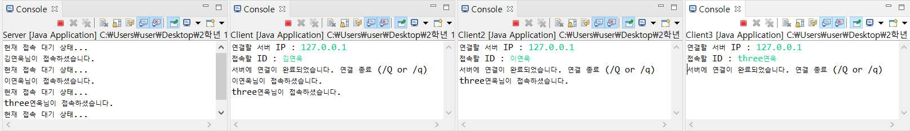
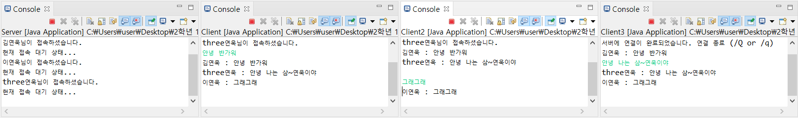
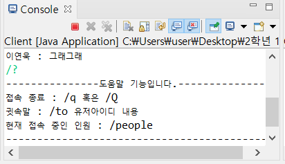
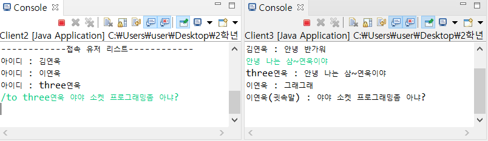
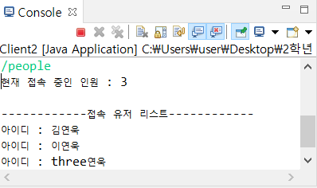
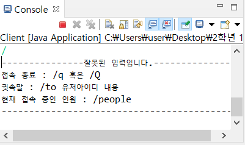
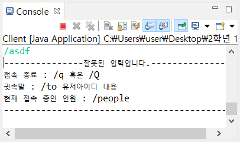
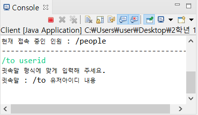
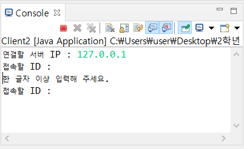
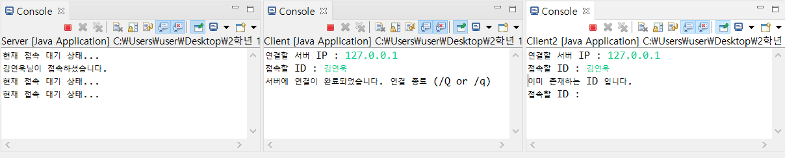

# TCPIP_Final_Project

---

## TCP/IP 기말고사 프로젝트

### 개발 환경

- IDE : Eclipse
- Language : Java

---

### 프로젝트 설명

- 서버에 접속하는 사용자끼리 채팅을 할 수 있는 프로젝트이다.
- 세마포어를 사용하였으며, 이진 세마포어이다.
- 자바에는 뮤텍스 라이브러리가 존재하지 않아서 이진 세마포어를 사용하였다.

---

### 프로젝트 흐름

1. 접속하고자 하는 서버의 IP를 입력한다.
2. 접속 시 사용할 ID를 입력한다.
3. 접속이 완료되면 접속된 사용자들과 채팅을 할 수 있다.
4. 채팅의 부가적인 기능으로는 "/"를 이용한 도움말, 귓속말, 접속한 유저 보기 기능이 존재한다.
5. 채팅을 종료하려면 /q 혹은 /Q를 입력한다.

---

### 프로젝트 흐름 이미지

- 실행 후 접속 화면
 </img>

- 채팅 중인 화면
 </img>

- 도움말 기능 화면
 </img>

- 귓속말 기능 화면
 </img>

- 접속 중인 사용자 보는 화면
 </img>

---

### 프로젝트 입력에 대한 예외 처리 이미지

- "/" 만 입력하였을 경우
 </img>

- "/" 다음 옳지 않은 입력을 하였을 경우
 </img>

- "/to" 다음 옳지 않은 입력을 하였을 경우
 </img>

- ID 입력시 공백을 입력하였을 경우
 </img>

- ID가 중복되었을 경우
 </img>
